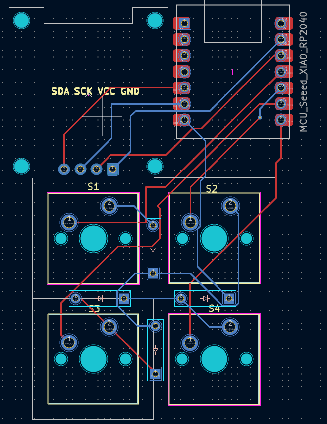
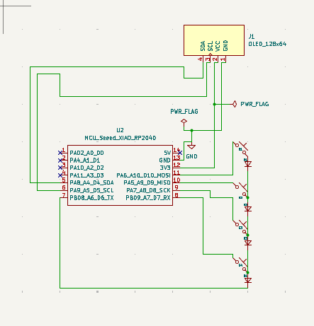
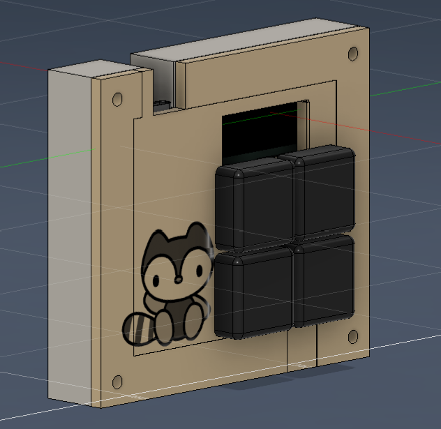

# Laya Core – 4-Key OLED Macropad 

**honestly this was my first project and this would be my 3rd edit i have added a oled that displays a cute pic**

This project includes a **custom PCB**, **KMK firmware**, and a **3D-printed case**.

---

##PARTS USED

- 4 programmable mechanical keys  
- XIAO RP2040 microcontroller  
- OLED display (I2C, 128×64)  
- KMK (CircuitPython-based) firmware  
- Custom PCB designed in KiCad  
- 3D printed enclosure (Fusion 360)
- 4 × M3 × 10 mm self-tapping screws  

---

## Firmware

- Written using **KMK firmware**
- Supports:
  - Custom keyboard shortcuts i just have added (screenshots, copy, paste, etc.)
  - OLED bitmap display (cute robot graphic)

> Firmware source code is available in this repository.

---

## 📸 Project Images

### 🟢 PCB Layout
<!-- Add your PCB image here -->

---

### 🔵 Schematic
<!-- Add your schematic image here -->

---

### 🟣 Final 3D Model (Fusion 360)
<!-- Add your Fusion 360 render here -->

---

## 🔌 OLED Display

- OLED communicates via **I2C**
- Resolution: **128 × 64**
- Displays a custom bitmap 
---

## 🧩 Bill of Materials (BOM)

> Prices are approximate 

| Sl No | Component                              | Quantity | Approx Price (₹) | Total (₹) |
|-----:|---------------------------------------|---------:|-----------------:|----------:|
| 1    | XIAO RP2040 Microcontroller           | 1 | 650 | 650 |
| 2    | Mechanical Switches (MX compatible)   | 4 | 50 | 200 |
| 3    | Keycaps                               | 4 | 40 | 160 |
| 4    | OLED Display (SSD1306, 128×64, I2C)   | 1 | 250 | 250 |
| 5    | Diodes (1N4148 / SMD)                 | 4 | 5 | 20 |
| 6    | Custom PCB                            | 1 | 300 | 300 |
| 7    | Reset Button (SMD / Through-hole)     | 1 | 20 | 20 |
| 8    | USB Type-C Cable                      | 1 | 100 | 100 |
| 9    | 3D Printed Case                       | 1 | 250 | 250 |
| 10   | M3 × 10 mm self-tapping screws        | 4 | 50 | 50 |

### 💰 **Estimated Total Cost:** **₹2,020**

---

## 🛠️ Tools Used

- **KiCad** – schematic and PCB design  
- **Fusion 360** – 3D modeling  
- **KMK Firmware** – keyboard firmware  
- **CircuitPython**  
- **Git & GitHub**
---

## 💙 Author

**Sreelaya TS**  
---

